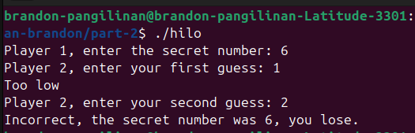
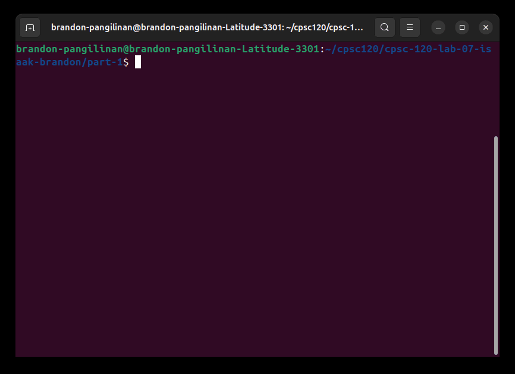

# Hello World

### About Me

Welcome to my home page! 
My name is Brandon Pangilinan, and I am a student at [California State University Fullerton](http://www.fullerton.edu/) majoring in Computer Engineering.

---

### GitHub

My GitHub page is *http://github.com/bpangilinan23.*

---

### Computer Science Projects:

##### CPSC 120 - Intro To Programming:

1. **Lab 4 - Part 2**

    * One of my favorite labs we did was Lab 4 - Part 2, which used if statements to make a game that guessed high or low numbers. This lab was relatively easy, which is why it was one of my favorites, but it was also nice to create a game that needed certain conditions to work correctly.

        | Test Cases | Output |
        |----------------|----------------|
        | Secret: 6   Guess: 2 & 6 |  | 
        | Secret: 6   Guess: 1 & 2 |  |

2. **Lab 7 - Part 1**

    * Another one of my favorite labs was Lab 7 - Part 1; This one stood out to me since it dealt with a more real-world problem. This lab wanted to make a program that followed strict parking rules, given different values/arguments. It was pretty hard to ensure all the conditions were met, nevertheless it was great practice for things like Boolean expressions.

        

3.  **Lab 8 - Part 2**

    * Lastly, Lab 8 - Part 2 was a favorite, mostly because it used patterns and loops. I had a little trouble tracing loops, especially nested ones, and differentiating how the inner and outer loops affect each other. Doing this lab was helpful since it also generated a visual understanding of the nested loops under different conditions.

        ### Output
        > 
